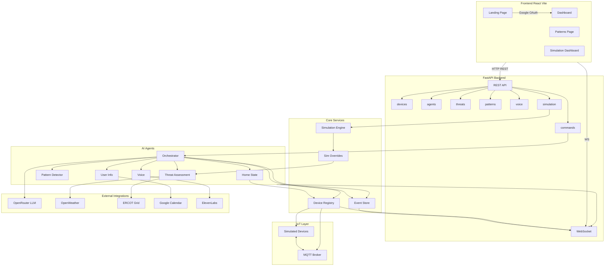
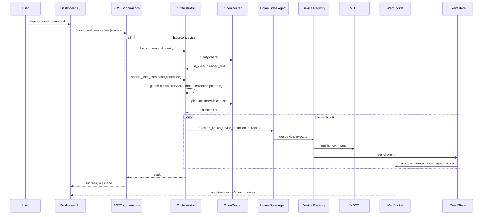

# Lumos — Smart Home Agent System

**Lumos** is an intelligent, context-aware smart home platform powered by a multi-agent AI layer. It coordinates devices, fuses weather and grid data (e.g. ERCOT), learns usage patterns, and responds to natural-language and voice commands—with a full simulation environment for testing without real hardware.

---

## Table of contents

- [Inspiration](#inspiration)
- [What it does](#what-it-does)
- [How we built it](#how-we-built-it)
- [Challenges we ran into](#challenges-we-ran-into)
- [Accomplishments that we're proud of](#accomplishments-that-were-proud-of)
- [What we learned](#what-we-learned)
- [What's next for Lumos](#whats-next-for-lumos--smart-home-agent-system)
- [Technical reference](#technical-reference)
  - [Quick start](#quick-start)
  - [Environment variables](#environment-variables)
  - [Architecture](#architecture)
  - [Agent network](#agent-network)
  - [User command flow](#user-command-flow)
  - [Project structure](#project-structure)
  - [Key files](#key-files)
- [License](#license)

---

## Inspiration

Traditional smart homes are mostly rule-based: "if time is 7am, turn on the coffee maker." They don't use real-time weather, grid stress, or your calendar. We wanted a home that **reasons** about context—heat waves, ERCOT alerts, meetings, and your own routines—and acts proactively (pre-cool before peak heat, charge the battery, switch to eco mode) instead of waiting for simple triggers.

We were also inspired by the idea of a **digital twin** of the home: an agent that knows every device, respects critical constraints (never turn off the fridge or lock yourself out), and learns from how you actually use the system. Adding **voice** and **pattern learning** made it feel less like programming and more like having a smart home that adapts to you.

---

## What it does

- **Landing & sign-in** — A marketing landing page (hero, bulb section, "money saved" counter) and **Google sign-in**. Once authorized, you get access to the dashboard; logout signs you out of both the app and your Google account.

- **Dashboard** — Room-based device cards, energy summary, a **threat banner** (The Oracle: heat wave, grid strain, storm, etc.) with recommended actions, voice alerts, and a natural-language command bar (text or voice). Everything updates in real time over WebSocket.

- **Patterns** — The system detects **routines** (e.g. weekday morning: lights on, coffee on), **preferences** (e.g. you always bump the thermostat after an auto-adjustment), and **energy patterns**. You can view, enable, or tune pattern-based automations.

- **Simulation** — A full **simulation dashboard** for demos and testing: run pre-built scenarios (temporal and instant), override weather, ERCOT grid, GPS location, battery state, and device failures. Time control and an event log let you replay or stress-test behavior without real hardware.

- **Smart execution** — Behind the scenes, an **Orchestrator** uses an LLM to plan actions while respecting critical devices (fridge, lock, battery), **home modes** (normal, focus, sleep, preparing_for_meeting), and user permissions for voice. The **Threat** agent can auto-trigger the orchestrator on HIGH/CRITICAL threats; **Voice** (ElevenLabs) gives spoken feedback and alerts.

---

## How we built it

We split the system into three main layers:

1. **Frontend (React + Vite + TypeScript)** — Landing page, Google OAuth, protected routes, and three main views: Dashboard, Patterns, and Simulation. We use Tailwind CSS, Radix UI, Framer Motion, and Recharts. The dashboard and simulation pages consume REST APIs and a **WebSocket** (`/ws`) for live device state, agent actions, and threat updates.

2. **Backend (FastAPI + Python)** — REST routes for devices, commands, agents, threats, patterns, voice, and simulation; a single WebSocket endpoint that pushes typed messages to all connected clients. The **device registry** loads a YAML config of simulated devices (lights, thermostats, plugs, sensors, lock, water heater, battery, coffee maker) and talks to an **MQTT** broker (Mosquitto) for state and commands. Storage is SQLite (events, patterns) and ChromaDB (for pattern/context).

3. **Agent layer** — A central **Orchestrator** starts and coordinates five sub-agents: **Threat Assessment** (OpenWeather + ERCOT → LLM → threat level/type/actions), **Pattern Detector** (event history + Chroma + LLM → routines/preferences/energy patterns), **Home State** (LangChain tools + device registry to execute actions), **Voice** (ElevenLabs TTS, permission phrasing via LLM), and **User Info** (Google Calendar + GPS/geofence for location and calendar context). The orchestrator uses **OpenRouter** for all LLM calls and enforces critical-device rules and home modes. For demos, a **simulation engine** lets us override weather, grid, GPS, battery, and device failures so we can test threat and mode flows without real APIs or hardware.

We use **Mermaid** in the repo for architecture and agent-network diagrams; see [Architecture](#architecture) and [Agent network](#agent-network) below.

---

## Challenges we ran into

- **Orchestrator prompt design** — Getting the LLM to only output valid device actions (no hallucinated device IDs or actions) and to respect critical devices and home modes required careful prompt structure and dynamic injection of the device inventory and action reference from the registry. We iterated on JSON response schemas and added "not_understood" and clarity checks for voice.

- **Threat → Orchestrator handoff** — When the Threat agent detects HIGH/CRITICAL, it calls the orchestrator to run threat-response actions (pre-cool, charge battery, eco mode). Coordinating that callback without circular imports and with clear permission/voice messaging took some refactoring.

- **Simulation vs. production** — We wanted one codebase that works with real MQTT and real APIs but also runs in a "simulation" mode with overrides (weather, ERCOT, GPS, battery, device failures). We introduced a simulation-override layer that the threat agent, ERCOT client, OpenWeather client, and user-info agent read from when overrides are set, so the rest of the pipeline stays unchanged.

- **Frontend auth and API base** — The frontend runs either as a dev server (e.g. localhost:5173) or as static files served by FastAPI (e.g. HTTPS 8443). Wiring Google OAuth (authorized origins, client ID) and ensuring the frontend knew the correct API base for REST/WebSocket in both setups required env and proxy/cors configuration.

---

## Accomplishments that we're proud of

- **Full agent network** — Six agents (Orchestrator, Threat, Pattern, Home State, Voice, User Info) working together with clear responsibilities and a single orchestrator that can reason over threat, calendar, location, patterns, and device state in one flow.

- **Real-time, type-safe frontend** — Dashboard and simulation UIs stay in sync with the backend via WebSocket; we use typed message payloads and React state so device cards, threat banner, and scenario timeline update without full-page reloads.

- **Simulation without touching production** — Overrides for weather, ERCOT, GPS, battery, and device failures let us demo heat-wave response, "user leaving home," and failure scenarios in a repeatable way. Temporal scenarios (multi-step timelines) make it easy to tell a story in a pitch or video.

- **Voice and patterns** — Voice commands with clarity checks and TTS feedback, plus pattern detection (routines, preferences, energy) that drives automations and user learning, make the system feel more adaptive and less "scripted."

- **Documentation** — We documented the full architecture and agent network in Mermaid (in this README and in `docs/ARCHITECTURE.md`) so onboarding and judging can follow data flow from UI to agents to devices and back.

---

## What we learned

- **LLMs need tight constraints in production** — Free-form "control my home" responses led to invalid actions. We got better results by giving the model a strict JSON schema, a dynamic device/action reference, and explicit rules (e.g. never turn off critical devices, sensors are read-only). For voice, a quick "clarity check" step reduced nonsense executions from bad transcriptions.

- **Agent boundaries matter** — Keeping Threat (data fusion + assessment), Pattern (learning + triggers), and Home State (execution) separate made it easier to test and override each part. The orchestrator stays a "planner" that delegates to these agents instead of doing everything itself.

- **Simulation as a first-class feature** — Building overrides and scenarios early made it possible to demo and debug threat and mode logic without depending on live weather or grid APIs. We could also test "user away" and "device failure" flows reliably.

- **WebSocket + REST** — Using REST for initial load and commands and WebSocket for live updates kept the frontend simple: one connection, typed events (device_state, agent_action, threat_update), and no polling for the dashboard.

---

## What's next for Lumos — Smart Home Agent System

- **Backend auth** — Right now the frontend uses Google OAuth for UI access; we’d like to validate the Google token on the backend and optionally tie it to user-specific preferences and pattern data.

- **Real devices** — Connect real smart-home devices (or device emulators) via MQTT or vendor APIs so Lumos can control actual lights, thermostats, and plugs instead of only simulated ones.

- **Mobile and PWA** — A mobile-friendly build or PWA so users can check the dashboard and run voice commands from their phone; we already support HTTPS and certificate download for local trust.

- **Richer patterns** — More pattern types (e.g. occupancy-based), better confidence and conflict resolution when multiple patterns match, and a clearer UI for "why did Lumos do that?"

- **Cost and reliability** — Monitor LLM and API usage, add retries and fallbacks for OpenRouter/OpenWeather/ERCOT, and consider caching or local models for critical paths.

- **Stretch: Twilio + ElevenLabs outbound calls** — On threat escalation (e.g. HIGH/CRITICAL), use **Twilio** to place an outbound call to the user and play an **ElevenLabs**-generated voice alert (e.g. "Heat wave alert: your home is pre-cooling. Grid stress is high.") so they’re notified even when they’re not in the app.

---

## Technical reference

The following sections cover setup, environment variables, architecture and agent-network diagrams, user command flow, project structure, and key files. For more workflow detail (startup, threat loop, simulation, device/MQTT), see [docs/ARCHITECTURE.md](docs/ARCHITECTURE.md).

### Prerequisites

- **Python 3** (see `.python-version` if using pyenv)
- **Node.js** and **npm** (for frontend build)
- **Mosquitto** MQTT broker (e.g. `brew install mosquitto` on macOS)
- **OpenRouter** API key (LLM)
- **Google OAuth** client ID (frontend sign-in) and optionally client secret (backend Calendar)
- Optional: **OpenWeather**, **ERCOT**, **ElevenLabs**, **Google Calendar** API keys for full functionality

---

### Tech stack (reference)

| Layer | Technologies |
|-------|--------------|
| **Frontend** | React 19, Vite 7, TypeScript, Tailwind CSS 4, Radix UI, Framer Motion, Recharts, React Router, Google OAuth (`@react-oauth/google`) |
| **Backend** | Python 3, FastAPI, Pydantic, Uvicorn; REST + WebSocket |
| **AI / agents** | LangChain, LangGraph, OpenRouter (LLM); ChromaDB for pattern/context storage |
| **IoT** | MQTT (Mosquitto), device registry from YAML |
| **Storage** | SQLite (event store, patterns), ChromaDB |
| **Integrations** | OpenWeather, ERCOT, Google Calendar, ElevenLabs |

---

### Quick start

1. **Clone and enter the repo**
   ```bash
   cd /path/to/Lumos
   ```

2. **Backend environment**
   - Copy `.env.example` to `.env` in the project root (if present), or create `.env` with at least:
   - `OPENROUTER_API_KEY` — required for orchestrator and threat/pattern agents.

3. **Frontend environment**
   - In `frontend/`, copy `.env.example` to `.env`.
   - Set `VITE_GOOGLE_CLIENT_ID` to your Google OAuth Web client ID (create at [Google Cloud Console](https://console.cloud.google.com/apis/credentials)); add your app origin (e.g. `http://localhost:5173` or `https://localhost:8443`) to **Authorized JavaScript origins**.

4. **Run the app**
   ```bash
   ./start.sh
   ```
   This script will:
   - Create a Python venv and install `requirements.txt` if needed
   - Build the frontend if `frontend/dist` is missing
   - Generate self-signed SSL certs in `certs/` if missing
   - Start Mosquitto (if installed) and the FastAPI server on **HTTPS port 8443**

5. **Open in browser**
   - Local: **https://localhost:8443**
   - On the same network: **https://\<LAN_IP\>:8443** (script prints the URL)
   - Accept the certificate warning once; then use the landing page, sign in with Google, and open the Dashboard, Patterns, or Simulation.

**Alternative (backend only, no HTTPS)**  
Run from project root with a pre-activated venv:
```bash
python -m uvicorn src.main:app --host 0.0.0.0 --port 8000 --reload
```
Then run the frontend separately (e.g. `cd frontend && npm run dev`) and use the dev server origin in Google OAuth.

---

### Environment variables

### Backend (project root `.env`)

| Variable | Description | Required |
|----------|-------------|----------|
| `OPENROUTER_API_KEY` | API key for OpenRouter (LLM) | Yes |
| `OPENROUTER_BASE_URL` | OpenRouter API base (default: `https://openrouter.ai/api/v1`) | No |
| `OPENROUTER_DEFAULT_MODEL` | Default model (e.g. `openai/gpt-4o-mini`) | No |
| `ELEVENLABS_API_KEY` | ElevenLabs TTS | For voice |
| `ELEVENLABS_VOICE_ID` | Voice ID (default provided) | No |
| `OPENWEATHERMAP_API_KEY` | OpenWeather API key | For threat/weather |
| `GOOGLE_CLIENT_ID` | Google OAuth client ID (backend) | For Calendar |
| `GOOGLE_CLIENT_SECRET` | Google OAuth client secret | For Calendar |
| `MQTT_HOST` | MQTT broker host (default: `localhost`) | No |
| `MQTT_PORT` | MQTT port (default: `1883`) | No |
| `HOME_LATITUDE`, `HOME_LONGITUDE` | Home location for geofence | No |
| `GEOFENCE_RADIUS_METERS` | Radius for “home” (default: 200) | No |

### Frontend (`frontend/.env`)

| Variable | Description | Required |
|----------|-------------|----------|
| `VITE_GOOGLE_CLIENT_ID` | Google OAuth Web client ID for sign-in | Yes for login |

---

### Architecture

The system is organized in three main tiers: **frontend** (React SPA), **backend** (FastAPI with REST and WebSocket), and **agents + devices** (orchestrator, sub-agents, device registry, MQTT). The diagram below shows how they connect and where external integrations plug in.



- **Frontend** talks to the backend over **REST** (devices, commands, agents, threats, patterns, voice, simulation) and **WebSocket** (`/ws`) for real-time device state, agent actions, and threat updates.
- **Commands** are handled by the **Orchestrator**, which uses the **OpenRouter** LLM and sub-agents to plan and execute device actions.
- **Device Registry** loads from `config/devices.yaml`, manages simulated devices, and communicates with the **MQTT** broker.
- **Simulation** engine and overrides can replace weather, grid, and other inputs for testing; overrides are consumed by the threat agent and related clients.

---

### Agent network

The **Orchestrator** is the central coordinator: it starts and uses five **sub-agents**, reads from **shared services** (Device Registry, Event Store, WebSocket), and relies on **integrations** (OpenRouter, OpenWeather, ERCOT, Google Calendar, ElevenLabs, ChromaDB). The following diagram shows the agent layer and the main control and data flows.

```mermaid
flowchart TB
    subgraph orchestrator [Orchestrator]
        Orch[Orchestrator]
        OrchLLM[OpenRouter LLM]
        Orch --> OrchLLM
    end

    subgraph subagents [Sub-agents]
        Threat[Threat Assessment]
        Pattern[Pattern Detector]
        HomeState[Home State]
        Voice[Voice]
        UserInfo[User Info]
    end

    subgraph shared [Shared services]
        DeviceRegistry[Device Registry]
        EventStore[Event Store]
        WS[WebSocket Manager]
    end

    subgraph homeStateInternals [Home State internals]
        DeviceTools[Device Tools]
        QueryTools[Query Tools]
        HomeState --> DeviceTools
        HomeState --> QueryTools
        DeviceTools --> DeviceRegistry
        QueryTools --> DeviceRegistry
    end

    subgraph integrations [Integrations]
        OpenWeather[OpenWeather]
        ERCOT[ERCOT]
        OpenRouter[OpenRouter]
        GoogleCal[Google Calendar]
        ElevenLabs[ElevenLabs]
        Chroma[ChromaDB]
    end

    Orch -->|"latest_assessment, summary"| Threat
    Orch -->|"location, calendar_context"| UserInfo
    Orch -->|"patterns, get_matching, log_event, learn_preference"| Pattern
    Orch -->|"execute_action, get_energy_summary"| HomeState
    Orch -->|"run (TTS), set_dnd_mode"| Voice
    Threat -->|"handle_threat_assessment (HIGH/CRITICAL)"| Orch

    Threat --> OpenWeather
    Threat --> ERCOT
    Threat --> OpenRouter
    UserInfo --> GoogleCal
    Voice --> ElevenLabs
    Pattern --> Chroma
    Pattern --> OpenRouter

    HomeState --> EventStore
    HomeState --> WS
    Threat --> WS
    Pattern --> EventStore
    Voice --> EventStore
    Voice --> WS
    UserInfo --> EventStore
    Orch --> DeviceRegistry
    Orch --> EventStore
```



**Flow summary:**

| From | To | Purpose |
|------|-----|---------|
| **Orchestrator** | Threat | Read latest threat assessment and summary for context in user commands and threat response. |
| **Orchestrator** | User Info | Read location and calendar context for home mode (e.g. preparing_for_meeting). |
| **Orchestrator** | Pattern | Read active patterns; get matching patterns for triggers; log device events; learn user preferences. |
| **Orchestrator** | Home State | Execute device actions (user commands, threat response, patterns, mode changes). |
| **Orchestrator** | Voice | Run TTS alerts and feedback; set DND mode for sleep/meeting. |
| **Threat** | Orchestrator | On HIGH/CRITICAL threat, call `handle_threat_assessment` for voice alert and device actions. |
| **Home State** | Device Registry | All device control and queries via LangChain tools (Device Tools, Query Tools). |
| **All agents** | Event Store / WebSocket | Persist events and broadcast state to the frontend. |

---

### User command flow

When a user types or speaks a command on the Dashboard, the request is sent to the backend; the Orchestrator gathers context from the other agents and the device registry, uses the LLM to plan actions, then executes them via the Home State agent. Device updates and agent activity are pushed to the UI over WebSocket.



---

### Project structure

```
Lumos/
├── config/
│   ├── devices.yaml      # Device definitions (rooms, types, energy, priority)
│   ├── settings.py       # Pydantic settings (env vars)
│   └── mosquitto.conf    # MQTT broker config
├── frontend/             # React + Vite SPA
│   ├── src/
│   │   ├── App.tsx       # Routes, layout, protected routes
│   │   ├── main.tsx      # GoogleOAuthProvider, AuthProvider
│   │   ├── components/   # landing, home, layout, sim, ui
│   │   ├── contexts/    # AuthContext
│   │   ├── hooks/       # useWebSocket, useApi, voice, etc.
│   │   ├── pages/       # Dashboard, Patterns, SimDashboard
│   │   └── types/
│   └── .env.example     # VITE_GOOGLE_CLIENT_ID
├── src/
│   ├── main.py          # FastAPI app, lifespan, routes, WebSocket, static serve
│   ├── agents/          # Orchestrator, Threat, Pattern, Home State, Voice, User Info
│   │   └── tools/       # device_tools, energy_tools, query_tools (LangChain)
│   ├── api/
│   │   ├── routes/      # devices, commands, agents, threats, patterns, voice, simulation
│   │   └── websocket.py # ConnectionManager, broadcast
│   ├── devices/         # Base device, registry, light, thermostat, plug, battery, etc.
│   ├── integrations/    # openrouter, openweather, ercot, google_calendar, elevenlabs
│   ├── models/          # device, command, events, pattern, threat
│   ├── mqtt/            # MQTT client, topics
│   ├── simulation/      # engine, overrides, scenarios, time_controller
│   └── storage/         # event_store, chroma
├── docs/
│   └── ARCHITECTURE.md  # Detailed architecture and workflow diagrams
├── start.sh             # Venv, frontend build, certs, Mosquitto, uvicorn HTTPS
├── requirements.txt
├── .env                 # Backend env (create from example)
└── README.md            # This file
```

---

### Key files

| Layer | Path | Purpose |
|-------|------|---------|
| Backend entry | `src/main.py` | FastAPI app, lifespan, CORS, routers, WebSocket, health, static frontend serve |
| Orchestrator | `src/agents/orchestrator.py` | Command handling, threat response, mode changes, pattern triggers, LLM planning |
| Threat agent | `src/agents/threat_assessment.py` | Weather + ERCOT fusion, threat level/type/actions, optional auto-trigger to orchestrator |
| Home State | `src/agents/home_state.py` | LangChain AgentExecutor, device/query tools, execute_action for orchestrator |
| Device registry | `src/devices/registry.py` | Load devices from YAML, start/stop, state, action reference, critical device list |
| WebSocket | `src/api/websocket.py` | ConnectionManager, broadcast to frontend |
| Simulation | `src/simulation/engine.py`, `src/simulation/scenarios.py` | Scenario runner, overrides, temporal steps |
| Frontend app | `frontend/src/App.tsx` | Routes, Layout, ProtectedRoute |
| Dashboard | `frontend/src/pages/Dashboard.tsx` | Rooms, energy, threat, voice, command input, WebSocket hook |
| Auth | `frontend/src/contexts/AuthContext.tsx` | User/token state, Google logout, session persistence |

For more workflows (startup, threat loop, dashboard data flow, simulation, device/MQTT), see **[docs/ARCHITECTURE.md](docs/ARCHITECTURE.md)**.

---

## License

See [LICENSE](LICENSE) in this repository.
